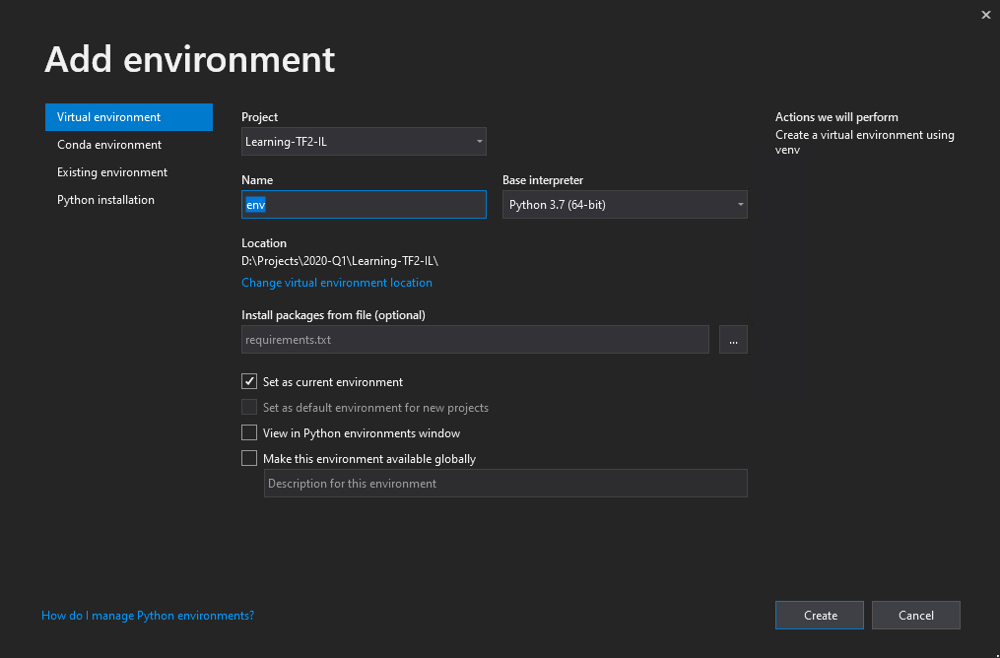
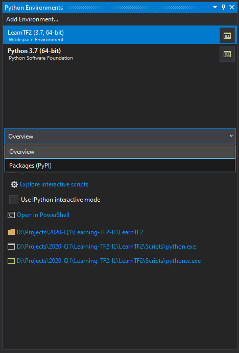
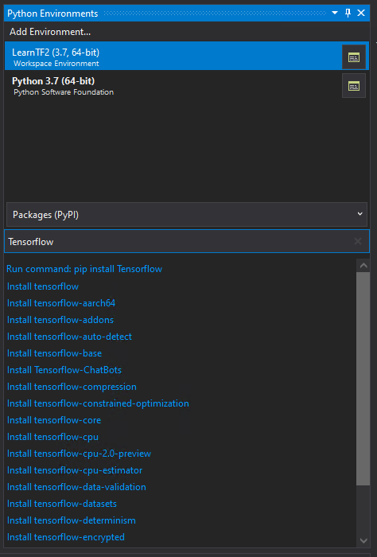
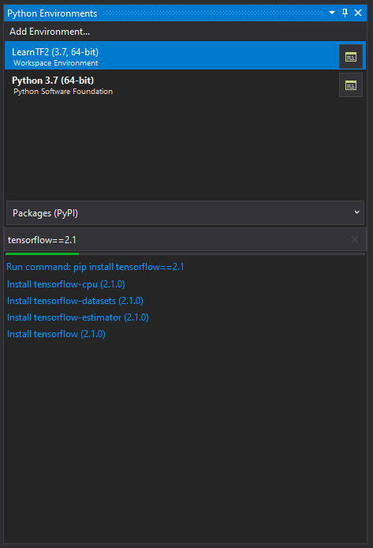
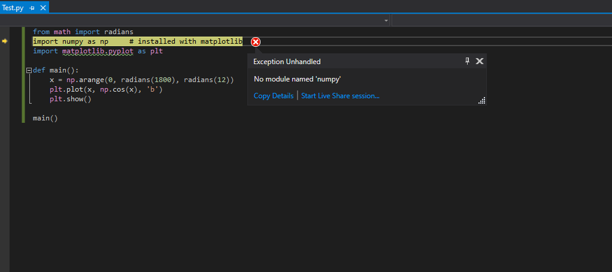

# Create an environment and install Tensorflow 2

1. Create an environment to work in
    - 
1. Select your enviornment in the VS Package manager
    - 
1. Type in Tensorflow to find tensorflow to install
    - 
1. Make sure to type "==2.1" to install the correct version
    - 
    
    
# Troubleshooting

- If you try and run code, but do not have the correct packages installed, you will get an error such as:
    - 
- GPU Setup : https://www.tensorflow.org/install/gpu#windows_setup
